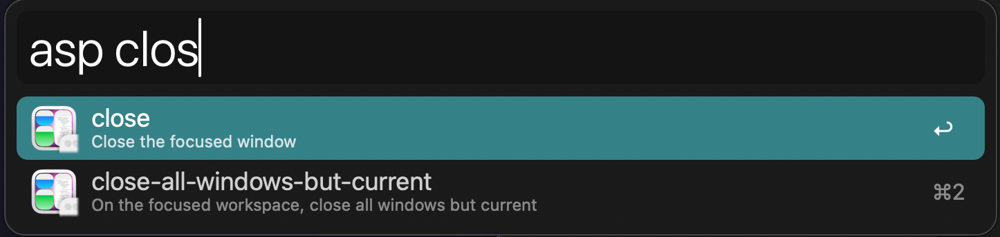

# alfred-aerospace

<!--toc:start-->

- [alfred-aerospace](#alfred-aerospace)
  - [Usage](#usage)
  - [Contribution is needed](#contribution-is-needed)
  <!--toc:end-->

Aerospace Tiling Window Manager Extension for Alfred

## Usage

Currently only commands which do not require options are working, such as:

- flatten-workspace-tree
- fullscreen
- macos-native-fullscreen
- reload-config
- enable
- close
- close-all-but-current
  ....

## Contribution is needed

1. Read about [Script Filter](https://www.alfredapp.com/help/workflows/inputs/script-filter/?ref=blog.lorentzca.me)
2. Modify [main.py](./main.py) file for command options
